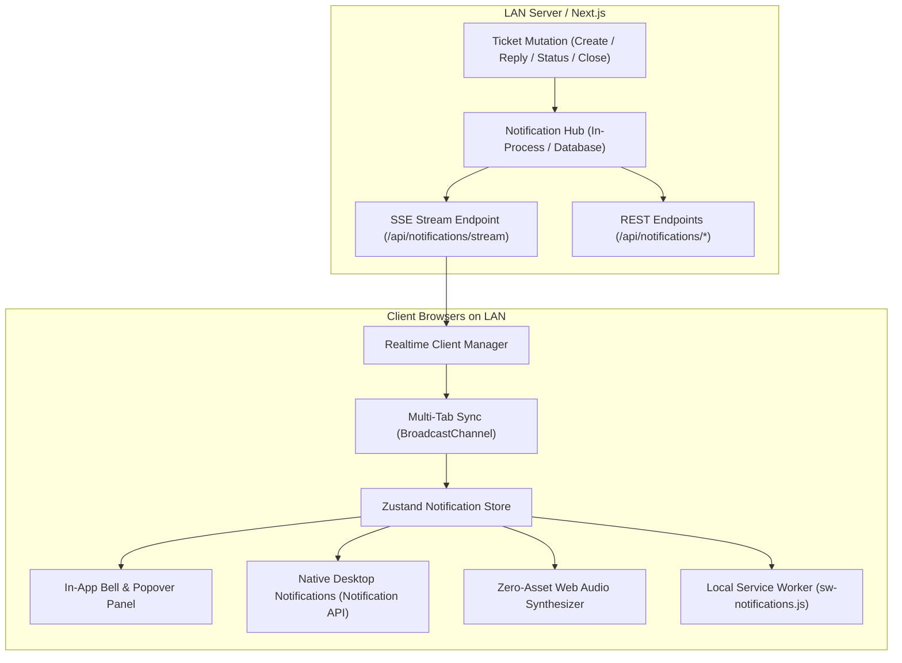

# LAN Real-Time Notification System

This document describes the architecture, operation, and deployment of the **Local-Network (LAN) Real-Time Notification System** for the Ticketing Application.

---

## 1. Overview & Offline / LAN Design Principles

The notification system is designed to operate **100% locally on an intranet or air-gapped local area network (LAN)** with zero dependency on external cloud push providers (such as Firebase Cloud Messaging, OneSignal, Pusher, or Ably).

```text
Internet: ❌ Not Required
LAN:      ✅ Required (Browser to Server)
Server:   ✅ Active
Browser:  ✅ Active
```

---

## 2. System Architecture



---

## 3. Supported Real-Time Events & Authorization

| Event Name | Trigger | Target Authorization |
| :--- | :--- | :--- |
| `ticket.created` | New ticket created | Assigned responders (`roleId === 1`) and group members |
| `ticket.reply.created` | New message on ticket | Ticket issuer and responder staff |
| `ticket.status.changed` | Ticket status updated | Ticket issuer and responder staff |
| `ticket.assigned` | Ticket assigned to user | Target assigned user |
| `ticket.closed` | Ticket closed | Ticket issuer and responder staff |

> **Security Rule**: The server validates user credentials, role IDs, and group IDs before dispatching events. Unauthorized users never receive notifications or ticket metadata for tickets they cannot access.

---

## 4. Components & Features

### 4.1 In-App Notification Bell & Panel
- **Unread Counter**: Real-time counter badge.
- **Connection Dot**: Real-time visual indicator (`green` = connected, `amber` = reconnecting, `gray` = disconnected).
- **Popover Panel**:
  - Filter tabs: **"All"** vs **"Unread"**.
  - Relative time formatting in Persian / English.
  - "Mark all as read" button.
  - Click-to-navigate action leading directly to `/tickets/{id}`.

### 4.2 Desktop Notifications & Service Worker
- Native desktop alerts with custom title, body, and icon.
- Deduplicated across open browser tabs via `BroadcastChannel`.
- Local Service Worker ([`public/sw-notifications.js`](file:///d:/Work/ticketing/public/sw-notifications.js)) handles background clicks to focus existing tabs or navigate to the ticket.

### 4.3 Zero-Asset Web Audio Chime
- Uses the browser's built-in **Web Audio API** to synthesize a harmonic dual-tone chime (587.33 Hz & 880.00 Hz) with zero external MP3/WAV assets.
- Fully compliant with browser autoplay policies.

### 4.4 User Preference Settings
- Toggles for Desktop notifications, Audio chime, New tickets, Assignments, Replies, Status changes, Closed tickets, and User group updates.
- Stored locally in `localStorage` and synchronized across tabs.

---

## 5. Nginx & Reverse Proxy Configuration for LAN

When deploying behind Nginx or a reverse proxy on your LAN, configure proxy buffering off for SSE:

```nginx
server {
    listen 80;
    server_name ticketing.local;

    location / {
        proxy_pass http://127.0.0.1:3000;
        proxy_http_version 1.1;
        proxy_set_header Upgrade $http_upgrade;
        proxy_set_header Connection 'upgrade';
        proxy_set_header Host $host;
        proxy_cache_bypass $http_upgrade;
    }

    # High-Performance LAN Realtime SSE Stream
    location /api/notifications/stream {
        proxy_pass http://127.0.0.1:3000;
        proxy_http_version 1.1;
        proxy_set_header Connection '';
        proxy_buffering off;
        proxy_cache off;
        proxy_read_timeout 86400s;
        chunked_transfer_encoding off;
    }
}
```
